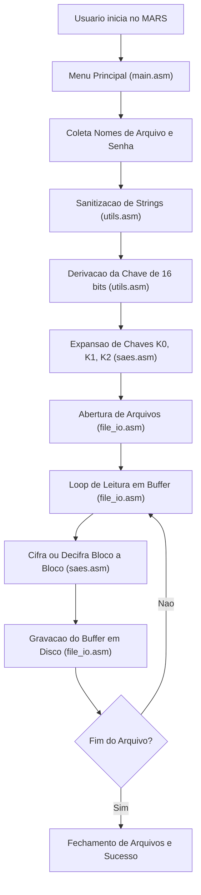

# SDD - Software Design Document: Criptógrafo S-AES em MIPS

Este diretório contém a documentação técnica formal, a arquitetura de software e as especificações de engenharia (**Spec-Driven Development - SDD**) para o **Trabalho 1 da disciplina ELC1011 (Organização de Computadores - UFSM, 2026/1)**.

---

## 1. Visão Geral do Projeto

O objetivo do sistema é fornecer uma aplicação em linguagem assembly **MIPS** para execução no simulador **MARS 4.5**, implementando a criptografia e descriptografia de arquivos utilizando o algoritmo **S-AES (Simplified Advanced Encryption Standard)** através de uma interface de terminal.

### 1.1 Algoritmo Selecionado
- **Alunos:** Miguel (matrícula final `72`) e Lucas (matrícula final `93`).
- **Critério:** Soma dos dígitos finais: $72 + 93 = 165$ (Ímpar) $\rightarrow$ **S-AES**.
- **Referência Oficial:** A especificação do algoritmo segue o padrão didático de Edward Schaefer / William Stallings, validada com o documento fornecido em [docs/simplified-aes-example.pdf](../simplified-aes-example.pdf).

---

## 2. Estrutura do SDD

O SDD está decomposto em duas seções principais:

### 2.1 Especificações (`specs/`)
Conjunto de especificações técnicas modulares que servem como guia estrito de implementação:

- [spec-01-arquitetura-e-convencoes.md](specs/spec-01-arquitetura-e-convencoes.md): Arquitetura global, divisão dos módulos, convenção de chamada de registradores e organização do código.
- [spec-02-tabelas-e-constantes.md](specs/spec-02-tabelas-e-constantes.md): Tabelas S-Box, InvS-Box, constantes RCON e tabelas de multiplicação no corpo finito $GF(2^4)$.
- [spec-03-nucleo-criptografico-saes.md](specs/spec-03-nucleo-criptografico-saes.md): Especificação detalhada do motor S-AES (Expansão de Chaves, Cifra e Decifra de blocos de 16 bits).
- [spec-04-io-arquivos-e-buffers.md](specs/spec-04-io-arquivos-e-buffers.md): Mecanismo de leitura/escrita em arquivos via Syscalls do MARS com streaming de buffer.
- [spec-05-interface-terminal-main.md](specs/spec-05-interface-terminal-main.md): Interface do usuário via terminal, menus, sanitização de strings e orquestração.
- [spec-06-plano-de-testes-e-validacao.md](specs/spec-06-plano-de-testes-e-validacao.md): Matriz de testes unitários e de integração com vetores de teste e automação via CLI.
- [spec-07-padroes-de-codificacao-e-estilo.md](specs/spec-07-padroes-de-codificacao-e-estilo.md): Diretrizes de estilo acadêmico (Prof. Giovani Baratto), rótulos em português, mapas de pilha/registradores e cabeçalhos.

### 2.2 Questões em Aberto (`questions/`)
Decisões de design, ambiguidades dos requisitos originais e propostas adotadas:

- [Q01-derivacao-chave.md](questions/Q01-derivacao-chave.md): Mapeamento da senha de texto `"ELC1011"` (7 bytes) para a chave de 16 bits do S-AES.
- [Q02-padding-arquivos-impares.md](questions/Q02-padding-arquivos-impares.md): Estratégia de preenchimento (*padding*) para arquivos com número ímpar de bytes.

---

## 3. Fluxo Geral de Dados

### 3.1 Diagrama de Fluxo (Texto / Visual)
```text
+-------------------------------------------------------------------+
|                     Usuario inicia no MARS                        |
+-------------------------------------------------------------------+
                                  |
                                  v
+-------------------------------------------------------------------+
|                      Menu Principal (main.asm)                    |
|          (1) Criptografar   (2) Descriptografar   (0) Sair        |
+-------------------------------------------------------------------+
                                  |
                                  v
+-------------------------------------------------------------------+
|         Coleta de Arquivo de Entrada, Saida e Senha de Acesso     |
+-------------------------------------------------------------------+
                                  |
                                  v
+-------------------------------------------------------------------+
|            Sanitizacao de Strings (trim_newline)                  |
|               e Derivacao de Chave de 16 bits                     |
+-------------------------------------------------------------------+
                                  |
                                  v
+-------------------------------------------------------------------+
|         Expansao de Chaves (saes.asm): K0, K1, K2                 |
+-------------------------------------------------------------------+
                                  |
                                  v
+-------------------------------------------------------------------+
|            Abertura dos Descritores de Arquivo (file_io.asm)      |
+-------------------------------------------------------------------+
                                  |
                                  v
                 +---> [Leitura de Buffer (512 bytes)]
                 |                  |
                 |                  v
                 |     [Processamento Bloco a Bloco]
                 |       saes_encrypt / saes_decrypt
                 |                  |
                 |                  v
                 |     [Gravacao do Buffer no Destino]
                 |                  |
                 |                  v
                 +---- Mais dados no arquivo? (Nao -> Fim)
                                  |
                                  v
+-------------------------------------------------------------------+
|         Fechamento dos Descritores e Mensagem de Sucesso          |
+-------------------------------------------------------------------+
```

### 3.2 Diagrama Mermaid (Para visualizadores com suporte a Mermaid)


