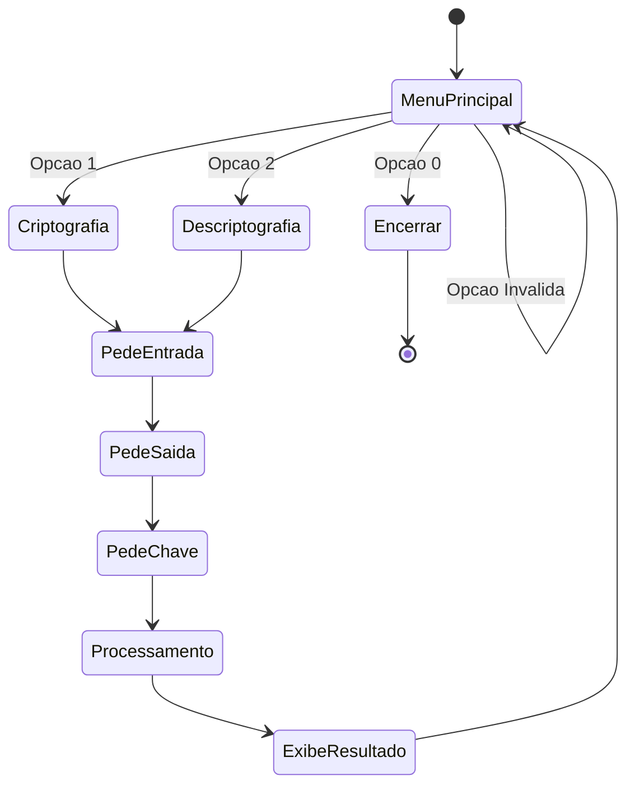

# Spec-05: Interface de Terminal e Fluxo de Execução Principal

## 1. Visão Geral
Esta especificação descreve a lógica do programa principal implementada em [src/main.asm](../../src/main.asm) e as rotinas de tratamento de strings em [src/utils.asm](../../src/utils.asm), em conformidade com as convenções da [Spec-07](spec-07-padroes-de-codificacao-e-estilo.md).

---

## 2. Requisitos da Interface de Terminal
Conforme os requisitos do trabalho:
1. Apresentar menu interativo solicitando a ação desejada:
   - `1`: Criptografar arquivo
   - `2`: Descriptografar arquivo
   - `0`: Encerrar o programa
2. Coleta de caminhos de arquivos:
   - **Para criptografia:** Solicitar arquivo de entrada (texto claro) e arquivo de saída (texto cifrado).
   - **Para descriptografia:** Solicitar arquivo de entrada (texto cifrado) e arquivo de saída (texto decifrado).
3. Coleta da chave de acesso:
   - Entrada de texto via Syscall 8 (dispensada a necessidade de ecoar asteriscos).
4. Exibição de mensagens de status, progresso e conclusão da operação.

---

## 3. Especificação do Tratamento de Strings e Chaves (`utils.asm`)

### 3.1 O Problema do `\n` na Syscall 8 do MARS
No simulador MARS, a chamada `Syscall 8` (Read String) lê a entrada do teclado e insere obrigatoriamente um caractere de quebra de linha `\n` (`0x0A`) antes do terminador nulo `\0` (`0x00`).
Se a string for repassada diretamente para a `Syscall 13` (Open File), a abertura do arquivo falhará porque o sistema operacional buscará um arquivo contendo um `\n` no nome.

### 3.2 Rotina `remove_quebra_linha`
- **Entrada:** `$a0` = Ponteiro para a string terminada em nulo.
- **Operação:** Percorre os caracteres da string até encontrar `\n` (`0x0A`), `\r` (`0x0D`) ou `\0`. Ao encontrar `\n` ou `\r`, substitui imediatamente por `\0` e encerra a rotina (`substitui_nulo`).
- **Retorno:** Nenhum.

### 3.3 Rotina `deriva_chave`
- **Entrada:** `$a0` = Ponteiro para a string da chave sanitizada.
- **Operação:** Itera pelos caracteres da senha acumulando bytes de índice par no byte mais significativo e bytes de índice ímpar no byte menos significativo via operação bitwise XOR (ver [Q01](../questions/Q01-derivacao-chave.md)).
- **Retorno:** `$v0` = Chave mestre de 16 bits resultante pronta para `expande_chave`.

---

## 4. Diagrama de Estados do Terminal

### 4.1 Máquina de Estados (Texto)
```text
           [Inicio]
              |
              v
     +--> [Menu Principal] -------------------> [Encerrar (Opção 0)]
     |        |          |
     |   (Opção 1)   (Opção 2)
     |        |          |
     |        v          v
     |   [Criptografia] [Descriptografia]
     |        |          |
     |        +----+-----+
     |             |
     |             v
     |   [Pede Arquivo de Entrada]
     |             |
     |             v
     |   [Pede Arquivo de Saida]
     |             |
     |             v
     |   [Pede Chave de Acesso]
     |             |
     |             v
     |   [Processamento de Buffer e Cifra/Decifra]
     |             |
     |             v
     |   [Exibe Resultado: Sucesso / Erro]
     |             |
     +-------------+
```

### 4.2 Diagrama Mermaid


---

## 5. Buffers Estáticos em Memória (`.data`)
Para armazenamento das entradas do usuário:
- `buffer_nome_entrada`: `.space 128` (Suporta caminhos relativos ou absolutos de até 128 caracteres)
- `buffer_nome_saida`: `.space 128`
- `buffer_chave`: `.space 64` (Suporta chaves de até 64 caracteres)
- `buffer_opcao`: `.space 16`
- `subchaves`: `.half 0, 0, 0` (3 palavras de 16 bits para $Key_0, Key_1, Key_2$ em `saes_tables.asm`)
